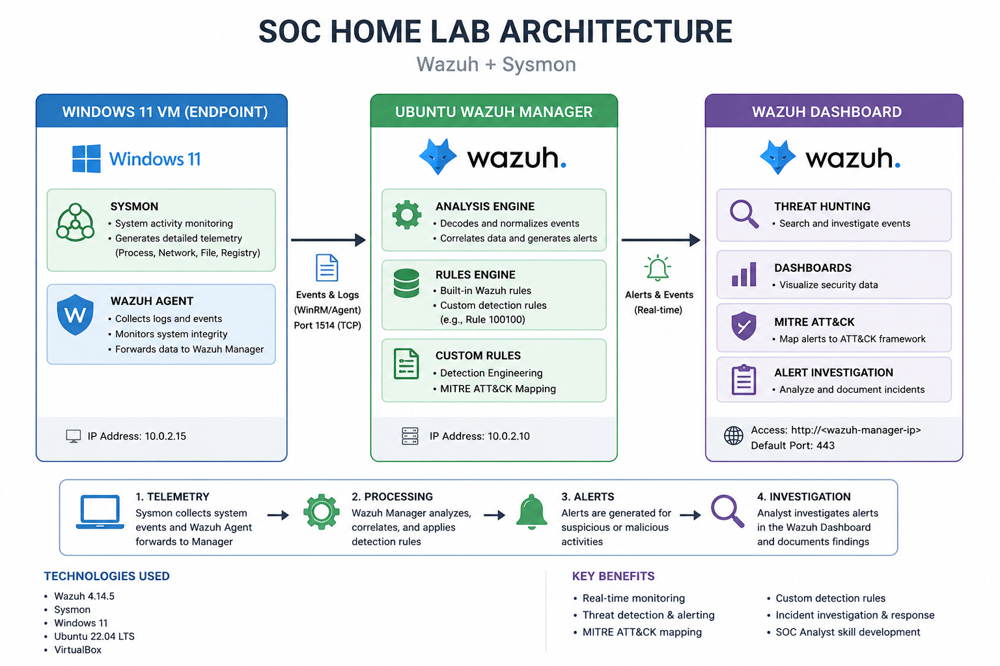

# Lab Architecture

The following diagram illustrates the architecture of the SOC home lab built using Wazuh and Sysmon.

---

## Components

### Windows 11 Endpoint

- Windows 11
- Sysmon
- Wazuh Agent

Responsibilities:

- Generate endpoint telemetry
- Monitor process creation
- Monitor file creation
- Monitor registry activity
- Forward events to Wazuh

---

### Wazuh Manager

Responsibilities:

- Receive events
- Decode Sysmon logs
- Apply detection rules
- Execute custom rules
- Correlate alerts

---

### Wazuh Dashboard

Used for:

- Threat Hunting
- Alert Investigation
- MITRE ATT&CK Mapping
- Dashboard Visualization

---

## Event Flow

1. Sysmon generates endpoint telemetry.
2. Wazuh Agent forwards logs to the manager.
3. Wazuh analyzes events.
4. Detection rules generate alerts.
5. Analysts investigate alerts in the dashboard.
