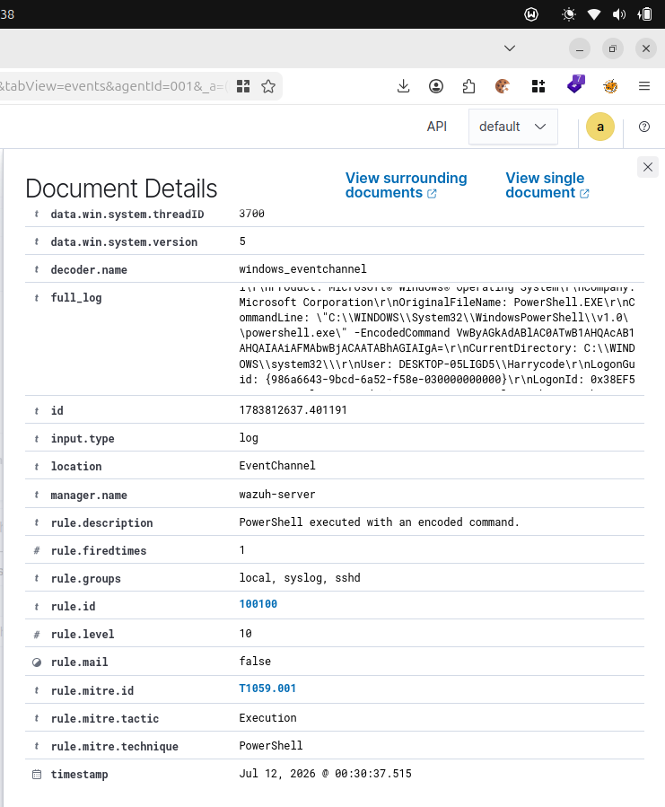

# Investigation 001 – Encoded PowerShell Execution

## Alert Summary

| Field | Value |
|-------|-------|
| Rule ID | 100100 |
| Rule Description | PowerShell executed with an encoded command |
| Rule Level | 10 |
| MITRE ATT&CK | T1059.001 |
| Tactic | Execution |
| Technique | PowerShell |

---

## Objective

Determine whether the execution of an encoded PowerShell command represented malicious activity or legitimate administrative testing.

---
## Why This Detection Was Created

PowerShell is a legitimate Windows administration tool, but it is also one of the most commonly abused utilities in cyber attacks.

Threat actors frequently use the `-EncodedCommand` (or `-enc`) argument to execute Base64-encoded PowerShell commands. Encoding the command helps obscure its contents from casual inspection and can make malicious activity harder to identify during routine monitoring.

While administrators may also use encoded commands for automation or scripting, the use of `-EncodedCommand` warrants investigation because it is a common technique observed in malware, ransomware, and post-exploitation frameworks.

This custom detection rule was created to improve visibility into encoded PowerShell execution and provide analysts with an alert that can be investigated in the context of user activity, parent process, command line, and subsequent behavior.

## Detection

A custom Wazuh rule was created to detect the use of the following PowerShell arguments:

- `-EncodedCommand`
- `-enc`

The rule successfully generated an alert when the encoded PowerShell command was executed.

---

## Evidence
## Alert Screenshot


### User

```
DESKTOP-05LIGD5\Harrycode
```

### Parent Process

```
powershell.exe
```

### Child Process

```
powershell.exe
```

### Command Line

```powershell
powershell.exe -EncodedCommand VwByAGkAdABlAC0ATwB1AHQAcAB1AHQAIAAiAFMAbwBjACAATABhAGIAIgA=
```

---

## Investigation

The command was manually executed during laboratory testing to validate a custom Wazuh detection rule.

Analysis confirmed:

- The command was initiated by the authorized lab user.
- The activity was expected.
- No persistence, privilege escalation, or lateral movement followed.
- The encoded command was intentionally used to validate detection capabilities.

---

## MITRE ATT&CK

- **Tactic:** Execution
- **Technique:** T1059.001 – PowerShell

---

## Verdict

**Benign administrative activity.**

The alert correctly detected the use of an encoded PowerShell command. The activity was intentionally generated as part of detection engineering and rule validation.

---

## Lessons Learned

- Encoded PowerShell is frequently used by attackers to evade detection.
- Custom Wazuh rules can identify suspicious PowerShell execution.
- Alert investigation should always include context before determining malicious intent.
